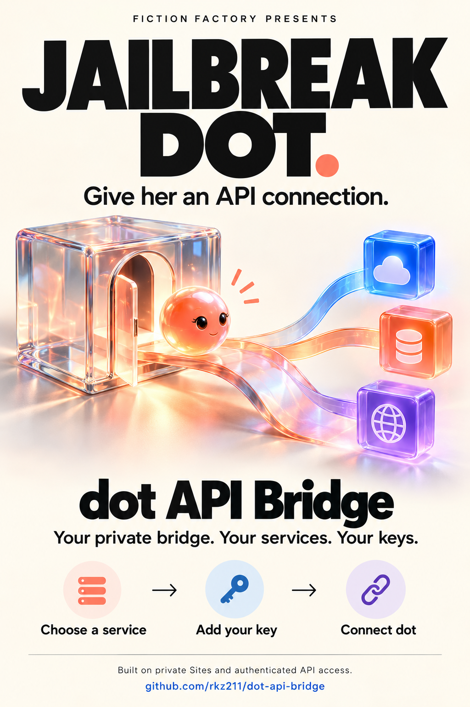

# dot API bridge

A private setup page and MCP connection for APIs your dot does not already have a supported tool for.



[Download the illustrated guide as a PDF](docs/assets/jailbreak-dot-api-bridge.pdf)

Start with what you want to do, a service name, its website, or a link to its agent instructions. Your dot reads the official documentation and prepares the connection. You review the destination and enter your API key directly in the private page. Then tell your dot what to do.

The page does not run an LLM or discover services on its own. Unknown services produce a copyable request for your dot. This bridge needs no external LLM API or LLM API key. Hosting and connected-service charges depend on your providers.

## Start here

- **Give your dot the [build instructions](agent-handoff.md)** and ask it to build your private bridge. The guide covers creation, deployment, storage, plugin connection, and verification.
- [Setup guide](SETUP.md): what happens during installation and how to connect a service
- [Security model](SECURITY.md): credentials, access control, request guards, and limitations
- [Cookiejar publishing sample](examples/README.md): small source archive for an authorized test
- [Source repository](https://github.com/rkz211/dot-api-bridge): canonical source and clone URL

This repository is source for your own owner-private Site. It is not a shared public API or a verified one-click directory installation.

Cookiejar is the included real example and is currently waitlist-stage. Its live examples require existing authorized API access; this repository does not grant access. The optional `example_rpc` service is a fictional RPC example demonstrating adapter mechanics, not another available provider.

## Guided connection setup

1. Choose a prepared service, or enter a service name, website, or agent-instructions link.
2. For a new service, give your dot the page's copyable request. It checks official documentation and calls `bridge_prepare_connection` with non-secret details.
3. Review what access the key grants, the verified key-help instructions, and the API destination.
4. Enter the key in the masked private key box and save it. A verified read-only check runs when one is configured.
5. Copy the ready connection's handoff and tell your dot the action you want.

You can test, replace, or disconnect a key from the same page. A connection without a configured check is shown as saved but not automatically verified. A successful check is not permission for future actions.

The saved API destination, authentication format, and key are authoritative. No environment-variable settings are required for this flow. The Site still needs its native `DB` binding, database migrations, private access policy, and managed plugin connection. There is no manual owner-ID gate or global write-enable switch.

## Available tools

| Tool | Purpose |
| --- | --- |
| `bridge_connection_info` | Verify Sites-managed authentication; includes the private caller ID |
| `bridge_prepare_connection` | Save non-secret API destination, authentication format, and setup guidance; never accepts a key |
| `bridge_connection_status` | Return safe connection metadata, readiness, and documentation links without keys or key fragments |
| `bridge_services` | Report available services and credential presence, not credential validity |
| `bridge_api_preview` | Validate a request without contacting the provider |
| `bridge_api_read` | Make GET/HEAD requests; configured bespoke RPC adapters can classify specific POST actions as reads |
| `bridge_api_write` | Make authorized POST/PUT/PATCH/DELETE requests with durable operation IDs |
| `bridge_api_upload` | Upload a bounded Cookiejar source ZIP to its validated signed destination |
| `bridge_operation_status` | Inspect a recorded operation without repeating a mutation |
| `cookiejar_owned_sites` | Read owned-site metadata with credentials excluded |
| `cookiejar_create_site` | Create an approved site with durable duplicate protection and returned-token redaction |
| `cookiejar_deploy_site` | Check ownership and source ZIP/hash, prepare a deployment, upload, and start its build |
| `cookiejar_operation_status` | Inspect the dedicated create/deploy operation outcome |

Generic connections do not need endpoint-by-endpoint business mappings. The agent supplies a relative path, method, optional query, and a bounded JSON/text/base64 body within the saved API base URL. Ordinary generic GET/HEAD requests use the read tool; other supported methods use the conservative write tool. The available tool is not authorization: user approval requirements still apply to each action.

For Cookiejar publishing, prefer the [dedicated flow](agent-handoff.md#cookiejar-publishing). Its source ZIP limit is 512 KiB. Starting a build does not establish that a site is live; the caller must follow status and verify the result.

## Interface and motion

The setup page uses a black, borderless interface with neutral selected and Ready states. A blended wormhole, thin prism rim, and sparse inward particles sit behind the stationary controls. Fifteen jewel cloud palettes include brighter orange, emerald, sapphire, violet, crimson, and yellow. Each shuffled bag uses every palette once, then reshuffles without repeating a color across the boundary. Each color holds for three minutes and blends for twelve seconds, so one bag lasts 48 minutes. Reloading starts a fresh shuffle. Yellow uses the same cloud treatment as every other color, with no separate portal light patch.

Mouse movement briefly energizes the existing background along its recent path. Faster motion produces stronger light, with a bounded 1.15-second fade. The effect uses twelve reusable traces and event-driven updates, with no idle animation loop, pointer storage, external assets, or sensor permissions. It does not move the page or portal. Touch devices and Reduced Motion disable the pointer effect; Reduced Motion also keeps the cloud palette static.

## Storage and trust

Keep the Site owner-private and retain Sites-managed authentication. The platform's owner-only access policy authorizes the managed caller. This worker does not isolate multiple owners' keys or operation records and must not be exposed directly where callers can forge identity headers.

Keys entered in the page stay server-side in the Site's built-in D1 database. Native storage is encrypted at rest by the platform, but authorized database administrators can read stored key values. This is not an inaccessible vault. Keys must never be pasted into chat, code, tool arguments, URLs, or browser storage.

Each key is bound to a normalized HTTPS destination and authentication format. A different destination or authentication format requires a new connection ID and a newly entered key. Request-time callers cannot override the destination or authentication header. Redirects are refused.

Disconnect clears the saved key and suppresses any legacy hosted-secret fallback for that connection. It does not revoke the provider's key or stop requests already in flight. Existing hosted-secret connections remain an optional compatibility path; owners do not need to migrate or re-enter their keys to keep those connections working.

Destination validation, credential-route checks, response redaction, and durable write tracking reduce risk. They are not a complete service permission model or a security certification. Read the [limits and operator responsibilities](SECURITY.md) before connecting a service.

## Development and verification

Use Node.js 22.13 or later for `node:sqlite`; Node.js 24 is recommended. Runtime execution has no external package dependencies.

```sh
npm test
npm run check
npm run build
```

The test workflow generates the UI before running the tests. The build places the Worker and runtime modules in `dist/server/`. [SETUP.md](SETUP.md#first-deployment-for-a-new-owner) covers native `DB` provisioning and migrations for both connection storage and the operation ledger. Preserve existing migration history when updating a Site.

Automated tests use synthetic data, fake keys, mocked provider requests, and local SQLite. The dependency-free UI checks in `ui/dom-test.mjs` exercise local behavior; they do not establish a production login, database, or provider connection. Authenticated reads have separately been verified on a private runtime. That does not verify a fresh deployment of this public source, another owner's account, or live publishing. Report local checks and live results separately.

## License

MIT. See [LICENSE](LICENSE).

The display name and repository are **dot API bridge** and [rkz211/dot-api-bridge](https://github.com/rkz211/dot-api-bridge). Package, tool, and sample verification identifiers retain their existing names for compatibility.
